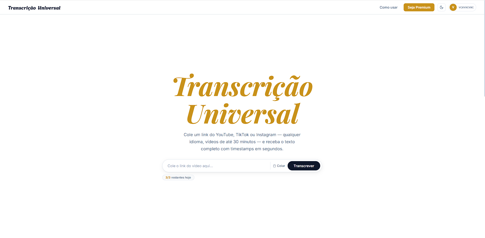

<div align="center">

# Transcrição Universal

**Transcreva qualquer vídeo do YouTube, TikTok, Instagram ou Twitter/X em segundos.**  
Basta colar o link. Nada para instalar. Funciona no navegador.

[](https://nodejs.org)
[](https://developer.mozilla.org/en-US/docs/Web/JavaScript)
[](https://supabase.com)



</div>

---

## O que faz

- Cola um link do YouTube, TikTok, Instagram ou Twitter/X
- O áudio é baixado e transcrito automaticamente com Whisper (Groq)
- O texto aparece na tela — pronto para copiar
- Plano gratuito com limite diário; **Premium** sem limites por PIX (R$5,00/mês)

---

## Funcionalidades

| | Gratuito | Premium |
|---|:---:|:---:|
| Transcrição (YouTube / TikTok / Instagram / Twitter) | ✅ | ✅ |
| Limite diário | 3/dia | Ilimitado |
| Sem anúncios | ❌ | ✅ |
| Cancelar / excluir conta a qualquer hora | ✅ | ✅ |

- Cadastro e login por e-mail + Google OAuth
- Recuperação de senha por e-mail
- Pagamento via PIX com ativação automática (MercadoPago)
- Exclusão de conta com confirmação de senha
- Interface 100% responsiva — celular e desktop

---

## Tecnologias

| Camada | Tecnologia |
|---|---|
| Backend | Node.js + Express |
| Banco de dados | Supabase (PostgreSQL) |
| Autenticação | JWT + bcryptjs |
| Transcrição | Groq Whisper API + yt-dlp |
| Pagamentos | MercadoPago (PIX) |
| E-mail | Nodemailer (Gmail SMTP) |
| Frontend | HTML + CSS + JavaScript puro |

---

## Como rodar

### Pré-requisitos

- [Node.js 18+](https://nodejs.org) instalado

### Passos

```bash
# 1. Clone o repositório
git clone https://github.com/ericdalaporta/transcricao-universal.git
cd transcricao-universal

# 2. Instale as dependências
npm install

# 3. Inicie o servidor
node server.js
```

Abra **http://localhost:3000** no navegador. Pronto.

> O arquivo `.env` já vem configurado no repositório com todas as chaves necessárias.  
> Não precisa criar conta em nenhum serviço — os pagamentos vão diretamente para o desenvolvedor.

---

## Estrutura

```
├── server.js      ← API back-end
├── index.html     ← App principal
├── login.html     ← Login e cadastro
├── schema.sql     ← Estrutura do banco de dados
├── .env           ← Configurações e chaves
└── package.json
```

---

## Licença

MIT © [Eric Dalaporta](https://github.com/ericdalaporta)
